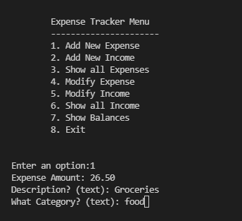
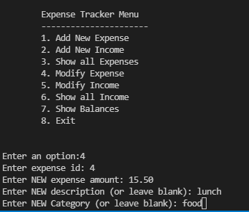

# expense-tracker-cli
A CLI app that tracks income and expenses. Currently the data is not stored when the application exits, that is for future versions.

## Screenshots

## TODOs
- Add Database to store data
- Improve CLI 
